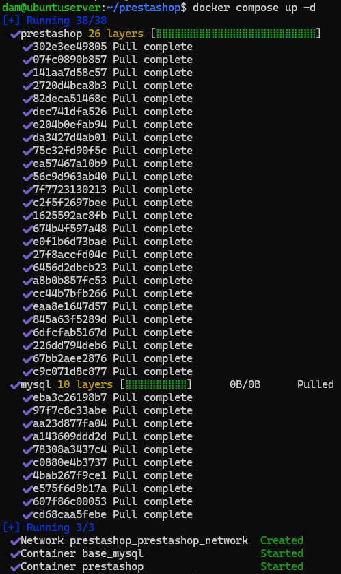
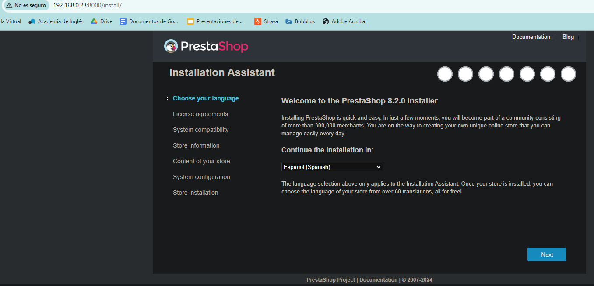
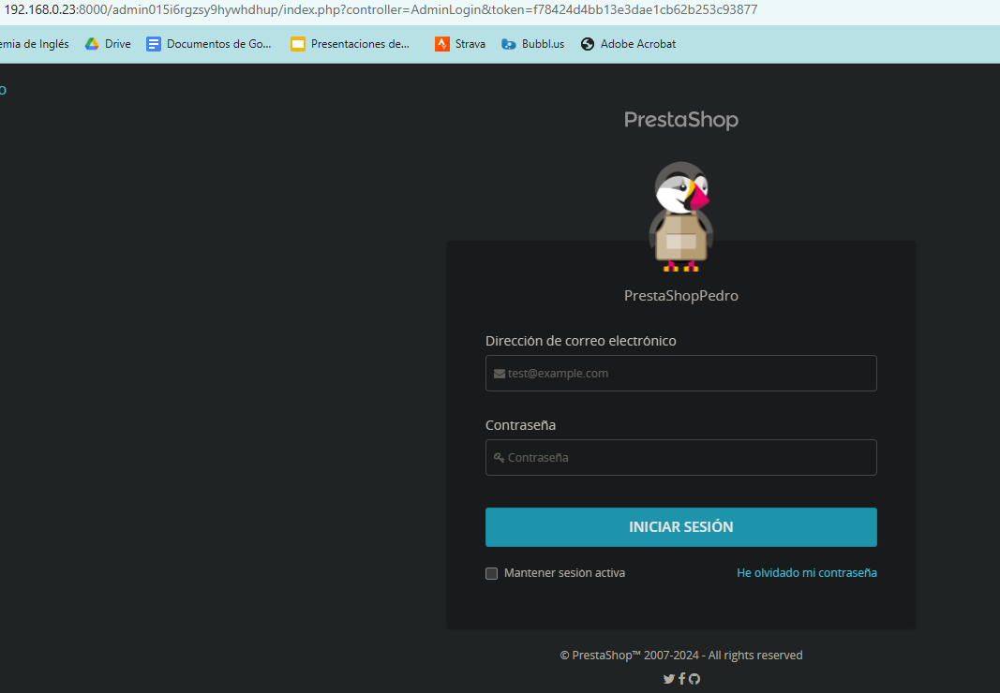
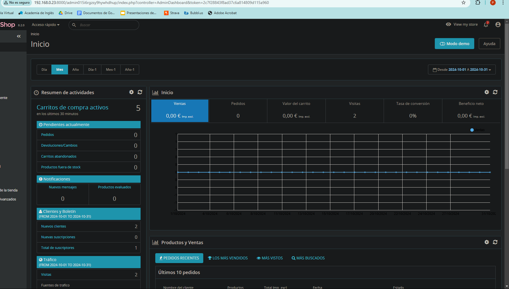

# Tarea 6 SXE -- Pedro Piñeiro
## Utiliza docker para poner en marcha Prestashop
### Primero creamos una carpeta para organizar los archivos y entramos en ella
```
mkdir prestashop
cd prestashop
```
### Creamos y accedemos al archivo docker-compose.yml
```
touch docker-compose.yml
nano docker-compose.yml
```
### Añadimos este contenido al archivo
```
services:
  mysql:
    image: mysql:latest # Indica la imagen que se va a utilizar
    container_name: base_mysql # Indica el nombre del contenedor
    restart: always # Indica que el contenedor se reiniciará siempre que se detenga
    environment:
      MYSQL_DATABASE: prestashop # Indica el nombre de la base de datos
      MYSQL_ROOT_PASSWORD: admin # Indica la contraseña del usuario root
    networks:
      - prestashop_network # Indica la red a la que pertenece el contenedor
  prestashop:
    image: prestashop/prestashop:latest 
    container_name: prestashop
    restart: always
    depends_on:
      - mysql # Indica que prestashop depende primero del arranque de mysql 
    ports:
      - 8000:80 # Indica el puerto utilizado
    environment:
      DB_SERVER: base-mysql # Indica el nombre del contenedor de la base de datos
      DB_NAME: prestashop # Indica el nombre de la base de datos
      DB_USER: root # Indica el usuario de la base de datos
      DB_PASSWD: admin # Indica la contraseña de la base de datos
    networks:
      - prestashop_network 
networks:
    prestashop_network:
```
### Guardamos el archivo y ejecutamos
```
docker compose up -d
```

### Esto confirma que los contenedores se han creado correctamente
___
### Ahora configuraremos PrestaShop
### Accedemos a la dirección http://(ip de la maquina):8000

### Para que la tienda funcione correctamente, debemos eliminar la carpeta install y cambiar el nombre de la carpeta admin
```
docker exec -it prestashop rm -rf /var/www/html/install
docker exec -it prestashop mv /var/www/html/admin /var/www/html/admin015i6rgzsy9hywhdhup 
```
### Por ultimo accedemos a http://(ip de la maquina):8080/admin015i6rgzsy9hywhdhup y completamos los datos

